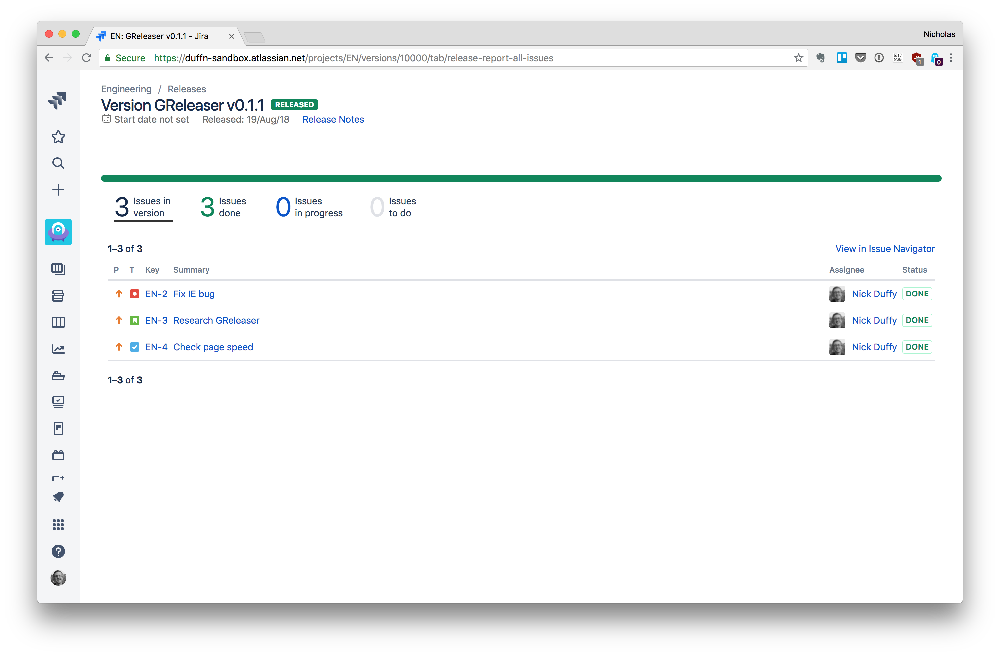
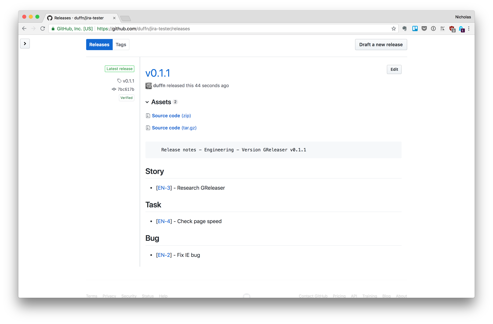

# GReleaser
Create releases in GitHub using release notes from a Jira version.

#### Turn this



#### Into this



## Setup
- Install with `npm install -g greleaser`
- Set the necessary environment variables.

```bash
export JIRA_ORGNAME='myjiraorg'
export JIRA_USERNAME='me@email.com'
export JIRA_PASSWORD='jirapassowrd'
export GITHUB_USERNAME='me'
export GITHUB_PASSWORD='githubpassword'
export GITHUB_ORG_NAME='mygithuborg'
```

Note that if you use 2FA on GitHub, you'll need to use a [personal access](https://help.github.com/articles/creating-a-personal-access-token-for-the-command-line/) with the `repo` scope in place of your GitHub password.

## Basic Use
- Get the ID of the version that you want release on GitHub from the Jira version page.
  - You can find the version ID in Jira in the URL when you are on the version page. The version in this example is `10015`.
  - https://myorg.atlassian.net/projects/ENG/versions/10015/tab/release-report-all-issues
- Run `greleaser -p <projectId> -v <versionNumber> -g <gitHubRepo>` to create a release in GitHub using the release notes from Jira.

## FAQ
- How's does Releaser know what GitHub repository to use for a release?

You specify the GitHub project name on the command line with the `-g` argument.

- What commit is tagged for a release?

By default, the `master` branch is tagged, but you can choose a different commit with the `-c` command line argument.

The tag name will be the version number pulled from the Jira version name. For example, if your Jira version is named `v1.0`, then the GitHub tag will be named `v1.0`. You can override the tag name with the `-t` option.

- What should my Jira releases be name?

You can name your Jira releases however you like, but Releaser is going to split the name on a space and use the last result in that array.

For example:
`v1.0` in Jira becomes `v1.0` in GitHub
`API v1.0` becomes `v1.0` in GitHub
`v1.0 API` becaomse `API` in GitHub

If this doesn't suit you, you can pass different release and tag names with the `-r` and `-t` options respectively.

- What other command line options are available?

```bash
greleaser -h
```

- Why does Releaser use pupetteer to get the Jira version release notes?

Release notes are not available in the Jira Cloud REST API.

## Examples
- Release Jira version 10001 in project 10003 to `my-github-project`.

```bash
greleaser -p 10003 -v 10001 -g my-github-project
```

- Release Jira version 10001 with a name of `v1.0` in project 10003 to `my-github-project`, tag commit `dca12345`, tag the commit as `version1` and call the release `My Release`.

```bash
greleaser -p 10003 -v 10001 -g my-github-project -c dca12345 -t version1 -r "My Release"
```

## TODO
- [ ] Tests
- [ ] CI
- [ ] Gitlab support
- [ ] Support Jira version search

## License
MIT
